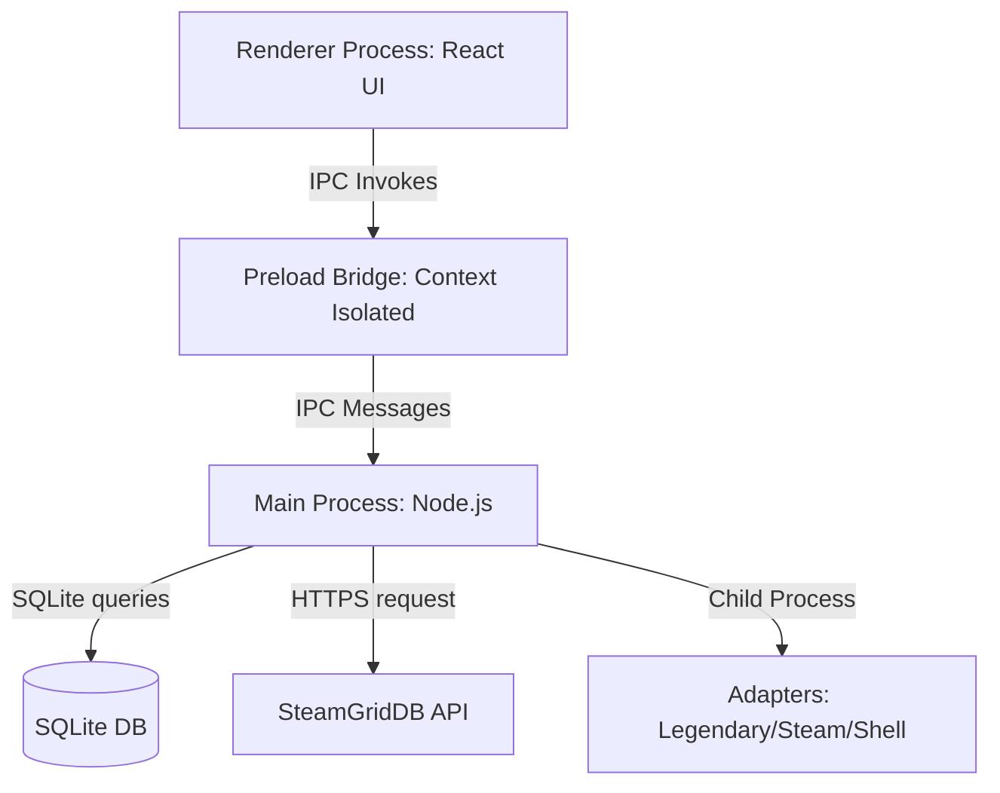

# Nexus Play Architecture

This document describes the technical architecture of Nexus Play.

## Process Architecture
Nexus Play is built on Electron, which enforces a strict separation of concerns between processes:

1. **Renderer Process**: A React app that manages the user interface, routing, rendering of visual tokens, list filters, settings input forms, and logs. It has NO direct system access.
2. **Preload Script**: A context-isolated script that exposes a type-safe `window.nexus` object to the React application, ensuring no raw shell/Node.js access is leaked to the UI.
3. **Main Process**: A Node.js environment that coordinates database access, executes shell commands via child processes, monitors running games, and hosts the custom `nexus-media://` protocol handler.

## Database & Data Persistence
- **Engine**: SQLite (`better-sqlite3` and `drizzle-orm`).
- **Location**: Installed at `~/.config/NexusPlay/library.db` on Linux.
- **Table Initialization**: Executed programmatically on app startup to prevent ASAR asset bundling issues with raw SQL migrations.

## Process & Playtime Tracking
When a game is launched:
1. The adapter launches the game and, if possible, returns the PID.
2. If a PID is returned (e.g. Legendary, Custom shell), the main process polls the PID using POSIX signals (`process.kill(pid, 0)`) every 3 seconds.
3. If no PID is returned (e.g. Steam client launches via `steam://` protocol URI), the process tree is searched for command lines containing the game's installation folder name using `pgrep -f`.
4. When tracking detects exit, the duration is computed, accumulated into `playtime_seconds`, and saved.

## Local Media Cache
- Banners and cover grids are downloaded via HTTPS and stored in `~/.cache/NexusPlay/assets/`.
- Local assets are securely served to the sandboxed renderer using a custom `nexus-media://` protocol handler, which prevents directory traversal attacks.
